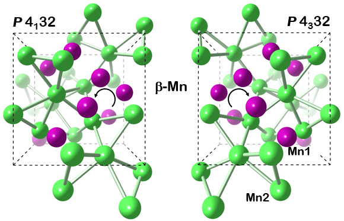
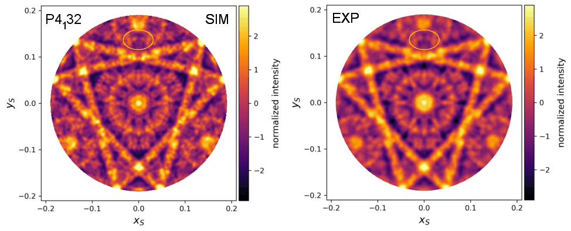
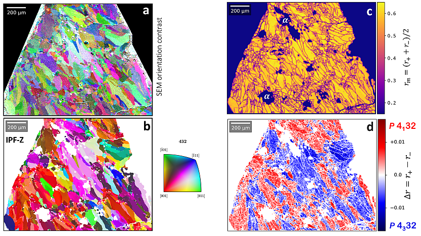
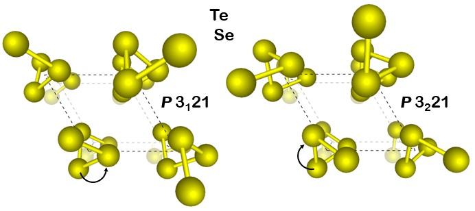
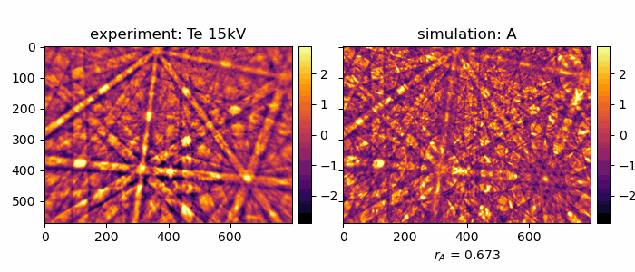
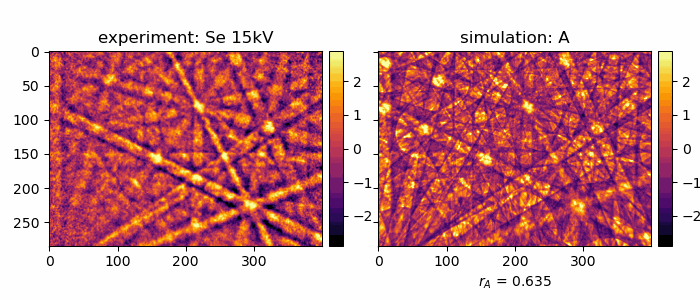
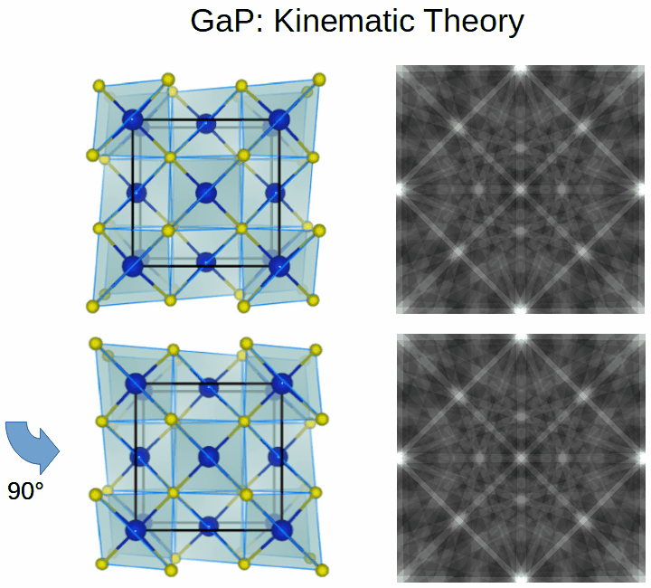
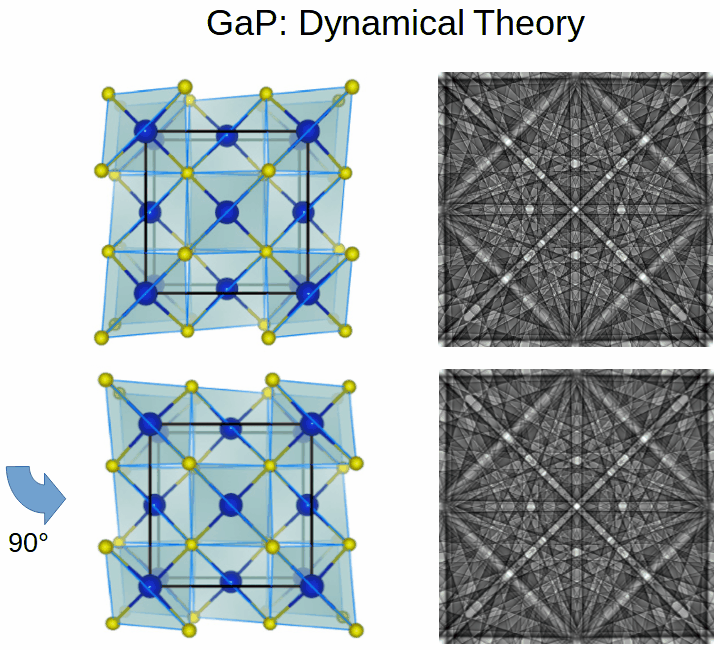

# Kikuchi Diffraction Effects of Non-Centrosymmetric Crystals: Chirality, Polarity, Absolute Structure

## Contents

[CoSi Chirality](#cosi)   
[&beta;-Mn Chirality](#manganese-chirality)   
[Te and Se Chirality](#tellurium-and-selenium)  
[GaP Polarity](#gap-polarity)   

## CoSi

### Literature 

**__Absolute Structure from Scanning Electron Microscopy__**  
Ulrich Burkhardt, Horst Borrmann, Philip Moll, Marcus Schmidt, Yuri Grin, Aimo Winkelmann   
Scientific Reports 10, 4065 (2020)  
[DOI: 10.1038/s41598-020-59854-y](https://doi.org/10.1038/s41598-020-59854-y) (Open Access)   
See also: [Supplementary Information](https://static-content.springer.com/esm/art%3A10.1038%2Fs41598-020-59854-y/MediaObjects/41598_2020_59854_MOESM1_ESM.docx)

### Crystal Structure

CoSi crystallizes in the FeSi (B20) structure type:

### Kikuchi Patterns

Experimental (top) and simulated (bottom) Kikuchi patterns measured from inversion twins of CoSi, primary beam voltage 15kV. 

## Manganese Chirality 

### Literature 

**__Fixing Left and Right: Assignment of Chiral Elemental Crystal Structures using Kikuchi Diffraction__**  
Aimo Winkelmann,  Grzegorz Cios, Tomasz Tokarski, Piotr Bała, Yuri Grin, Ulrich Burkhardt   
arXiv:2011.14422, Nov 2020   
[https://arxiv.org/abs/2011.14422](https://arxiv.org/abs/2011.14422)   

**__Assignment of enantiomorphs for the chiral allotrope &beta;-Mn by diffraction methods__**   
Ulrich Burkhardt, Aimo Winkelmann, Horst Borrmann, Andreea Dumitriu, Markus König, Grzegorz Cios, Yuri Grin   
Science Advances 2021 May 14;7(20):eabg0868.   
[DOI: 10.1126/sciadv.abg0868](https://doi.org/10.1126/sciadv.abg0868) (Open Access)   

### Crystal Structure

### Kikuchi Pattern Details

Kikuchi patterns of the two variants of &beta;-Manganese, measured at 20kV primary beam energy in the SEM.  
The raw experimental data has been symmetrized by 3-fold rotation around the \[111\] zone axis, 
without introducing mirror symmetry.
The feature marked by the oval is analyzed by profile plots in the manuscript.

### Chirality Mapping

Chirality mapping of polycrystalline Mn. 
(a) qualitative orientation grain contrast image based on the differential backscattered electron signal from the EBSD detector, 
(b) inverse pole figure map (IPF-Z) of the &beta;-Mn orientation data, (c) mean correlation coefficient relative to simulations,
(d) observed change of the correlation coefficient for simulated patterns of the two possible &beta;-Mn enantiomorphs relative to the experimental pattern.

## Tellurium and Selenium

### Literature 

**__Fixing Left and Right: Assignment of Chiral Elemental Crystal Structures using Kikuchi Diffraction__**  
Aimo Winkelmann,  Grzegorz Cios, Tomasz Tokarski, Piotr Bała, Yuri Grin, Ulrich Burkhardt   
arXiv:2011.14422, Nov 2020   
[https://arxiv.org/abs/2011.14422](https://arxiv.org/abs/2011.14422)   

### Crystal Structure

### Te

Comparison of an experimental Kikuchi pattern measured from a Te crystallite at 15kV  (left) to best-fit simulations for the two cases of space group *P*3221  (A, rA) and space group *P*3121 (B, rB). 

### Se

Comparison of an experimental Kikuchi pattern measured from a Se crystallite at 15kV  (left) to best-fit simulations for the two cases of space group *P*3221  (A, rA) and space group *P*3121 (B, rB). 

## GaP Polarity

In a kinematic model, Friedel's Law is valid and the diffraction pattern looks like there is a center of symmetry in the crystal structure. 
The presence of a 4-fold roto-inversion axis in GaP is not visible in a kinematic diffraction pattern, i.e. rotation by 90 degrees around [001] does not change the pattern.
The polarity of the [111] direction in GaP [111] cannot be assigned, i.e. [111] and the opposite direction [-1-1-1] are equivalent in kinematic theory. 

Dynamical Kikuchi diffraction is sensitive to the presence of a 4-fold roto-inversion axis in GaP. 
The directions [111] can be disciminated from the opposite direction [-1-1-1], polarity can be assigned. 
Rotation by 90 degrees around [001] switches the asymmetry in the (111) bands.

