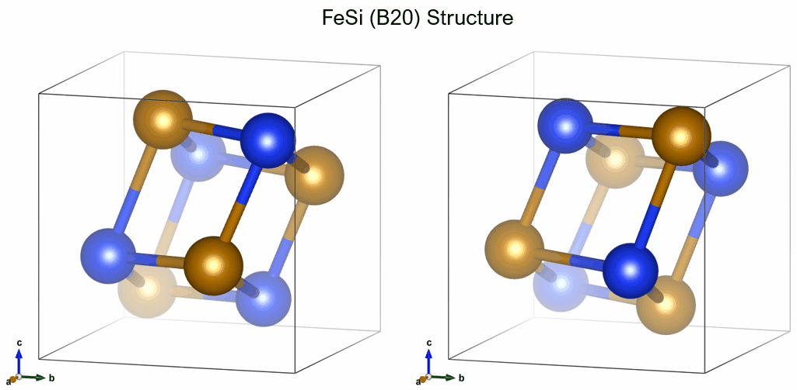
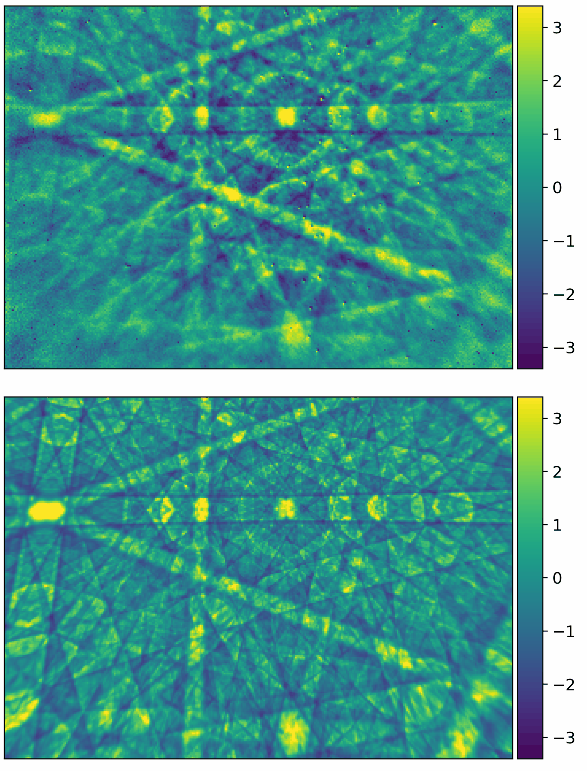

# Kikuchi Diffraction Effects of Non-Centrosymmetric Crystal Structures

## CoSi 

### Literature 

**__Absolute Structure from Scanning Electron Microscopy__**  
Ulrich Burkhardt, Horst Borrmann, Philip Moll, Marcus Schmidt, Yuri Grin, Aimo Winkelmann   
Scientific Reports 10, 4065 (2020) (Open Access)   
[DOI: 10.1038/s41598-020-59854-y](https://doi.org/10.1038/s41598-020-59854-y)  
See also: [Supplementary Information](https://static-content.springer.com/esm/art%3A10.1038%2Fs41598-020-59854-y/MediaObjects/41598_2020_59854_MOESM1_ESM.docx)

### Crystal Structure

CoSi crystallizes in the FeSi (B20) structure type:

### Kikuchi Patterns

Experimental (top) and simulated (bottom) Kikuchi patterns measured from inversion twins of CoSi, primary beam voltage 15kV. 

