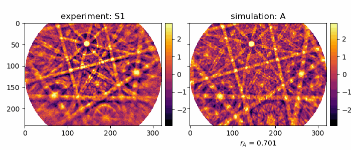
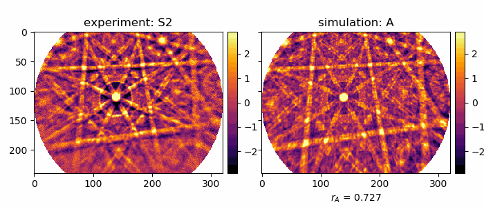
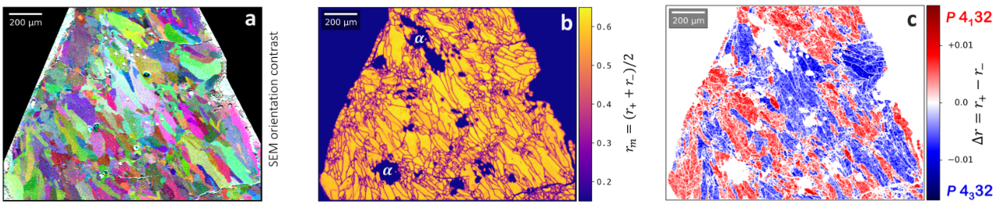

# Kikuchi Diffraction Effects of Non-Centrosymmetric Crystals: Chirality, Polarity, Absolute Structure

## Contents

[CoSi Chirality](#cosi)   
[&beta;-Mn Chirality](#manganese-chirality)   
[Te and Se Chirality](#tellurium-and-selenium)  
[GaP Polarity](#gap-polarity)   

## CoSi

### Literature 

**__Absolute Structure from Scanning Electron Microscopy__**  
Ulrich Burkhardt, Horst Borrmann, Philip Moll, Marcus Schmidt, Yuri Grin, Aimo Winkelmann   
Scientific Reports 10, 4065 (2020)  
[DOI: 10.1038/s41598-020-59854-y](https://doi.org/10.1038/s41598-020-59854-y) (Open Access)   
See also: [Supplementary Information](https://static-content.springer.com/esm/art%3A10.1038%2Fs41598-020-59854-y/MediaObjects/41598_2020_59854_MOESM1_ESM.docx)

### Crystal Structure

CoSi crystallizes in the FeSi (B20) structure type:

### Kikuchi Patterns

Experimental (top) and simulated (bottom) Kikuchi patterns measured from inversion twins of CoSi, primary beam voltage 15kV. 

## Manganese Chirality 

### Crystal Structure

### Kikuchi Pattern Details

Kikuchi patterns of the two variants of &beta;-Manganese, measured at 20kV primary beam energy in the SEM.  
The raw experimental data has been symmetrized by 3-fold rotation around the \[111\] zone axis, 
without introducing mirror symmetry.
The feature marked by the oval is analyzed by profile plots in the manuscript.

### FIB Samples

Example patterns from two differently oriented grains of &beta;-Manganese with opposite chirality. 
The better fitting enantiomorph (A vs. B) is indicated by the higher values
of the normalized cross-correlation coefficient rA or rB, respectively.
Simulation "A" indicates space group *P*4132 and "B" indicates space group *P*4332.
  

FIB Sample S1, 15kV:

FIB Sample S2, 15kV:

### Mapping of Chirality in a &beta;-Manganese Sample

Automated quantitative pattern matching provides the basis for the spatially resolved mapping of the chirality of &beta;-Mn samples in the SEM.
In the Figure below, we show the result of mapping a sample area of 1.56mm x 1.17mm with a step size of 2.6&mu;m, corresponding to a total number 600x450 measured EBSD patterns.

In (a), the polycrystalline microstructure of a &beta;-Mn sample is imaged by a qualitative grain orientation contrast map, which was obtained from the measured raw Kikuchi patterns by assigning a color signal to the intensity variations measured on different sub-areas of the EBSD detector. 
For each of the Kikuchi patterns of the map, the best-fit normalized cross-correlation coefficient (NCC) was determined for both possible space groups, which resulted in the local values of  r+ (*P*4132) and r- (*P*4332). 
From these values, the maps of the mean NCC rm and the difference map &Delta;r were derived, which are shown in (b) and (c), respectively.
The measured data points from the sample can have a varying significance, for example because of lower quality Kikuchi patterns which are observed at grain boundaries, in contaminated or deformed regions, or due to the presence of additional phases such as &alpha;-Mn.
In order to account for the different reliability of the discrimination between enantiomorphs and to exclude data points which cannot be trusted to indicate a significant chirality dependence, we have not considered data points with rm<0.4 for the map of &Delta;r in (c).
In the map shown (c), the sign of &Delta;r indicates the best-fit space group, i.e. positive for  *P*4132 and negative for *P*4332. 
Absolute values in the order of  &Delta;r > 0.01 indicate a reliable assignment of the space group and can be seen in (c) as red colors for positive &Delta;r (*P*4132) and blue colors for negative &Delta;r (*P*4332). 
It can be observed that map points within the individual &beta;-Mn grains are consistently identified with the same space group.
As can be seen by the similar numbers of red and blue grains in (c), the distribution of the two enantiomorphs in this sample does not show a significant preference for either of the two enantiomorphs.

## Tellurium and Selenium

### Crystal Structure

### Te

Comparison of an experimental Kikuchi pattern measured from a Te crystallite at 15kV  (left) to best-fit simulations for the two cases of space group *P*3221  (A, rA) and space group *P*3121 (B, rB). 

### Se

Comparison of an experimental Kikuchi pattern measured from a Se crystallite at 15kV  (left) to best-fit simulations for the two cases of space group *P*3221  (A, rA) and space group *P*3121 (B, rB). 

## GaP Polarity

In a kinematic model, Friedel's Law is valid and the diffraction pattern looks like there is a center of symmetry in the crystal structure. 
The presence of a 4-fold roto-inversion axis in GaP is not visible in a kinematic diffraction pattern, i.e. rotation by 90 degrees around [001] does not change the pattern.
The polarity of the [111] direction in GaP [111] cannot be assigned, i.e. [111] and the opposite direction [-1-1-1] are equivalent in kinematic theory. 

Dynamical Kikuchi diffraction is sensitive to the presence of a 4-fold roto-inversion axis in GaP. 
The directions [111] can be disciminated from the opposite direction [-1-1-1], polarity can be assigned. 
Rotation by 90 degrees around [001] switches the asymmetry in the (111) bands.

